# Proof of Authority Development Chain

For this assignment, We will take on the role of a new developers at a small bank.

We will set up a testnet blockchain for our organization/localhost.

To do this, We will create three deliverables:

* Set up our custom testnet blockchain.

* Send a test transaction.

* Write instructions (with images) on how to use the chain for the rest of your team.

# Here are the steps to set up testnet blockchain (For mac users only):

The Proof of Authority (PoA) algorithm is typically used for private blockchain networks as it requires pre-approval of, or voting in of, the account addresses that can approve transactions (seal blocks).  

## 1. Because the accounts must be approved, we will generate two new nodes with new account addresses that will serve as our pre-approved sealer addresses.

Open terminal. cd into the Blockchain-Tools folder and run the following commands (one by one)

#### ./geth --datadir node1 account new   
(it will prompt you for a password. Add password. Make sure to write and save it for later usage. Plus Copy and Paste - use notebook, we will use this in later steps - "Public address of the key" and "Path of the secret key file") 

#### ./geth --datadir node2 account new
(it will prompt you for a password. Add password. Make sure to write or save it for later usage. Plus Copy and Paste - use notebook, we will use this in later steps - "Public address of the key" and "Path of the secret key file") 

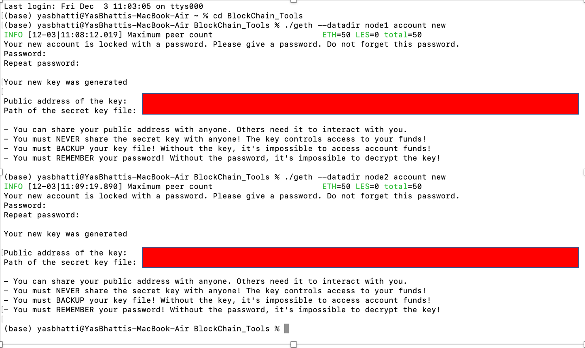

## 2. Next, generate your genesis block.

Enter the following command - You could use same terminal window or close the existing terminal window, and open a new one (Make sure to cd into the correct folder, Blockchain-Tools).
#### ./puppeth

## 3. name your network 
specify any network name (no "spaces", "hyphens" or "capital letters" please) - copy this for later reference/usage)

## 4. select the option to configure a new genesis block. 
####  ENTER 2 
"Configure new genesis"

## 5. What would you like to do? 
####  ENTER 1
"Create new genesis from scratch"

## 6. Which consensus engine to use? 
####  ENTER 2
Clique - proof-of-authority

## 7. How many seconds should blocks take?
####  ENTER 5 
use any number, default is 15

## 7. Which accounts are allowed to seal?
#### 0X-----------------
We need to fetch "Public address of the key" (minus "OX"), which we saved in step 1 above for node1. Hit Enter
#### 0X-----------------
Fetch "Public address of the key" (minus "OX"), which we saved in step 1 above for node2. Hit Enter
#### 0X-----------------
This time just Hit Enter

## 7. Which accounts should be pre-funded?
#### 0X-----------------
Enter "Public address of the key" (minus "OX"), which we saved in step 1 for node1. Hit Enter
#### 0X-----------------
Hit Enter (we don't need to fund the second node)

## 8. Should the precompile-addresses (0x1 .. 0xff) be pre-funded with 1 wei? (advisable yes)
Hit Enter

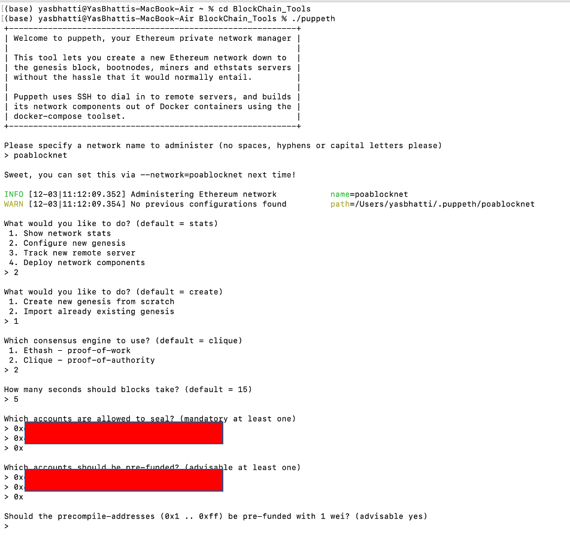

## 9. Specify your chain/network ID if you want an explicit one
#### Enter 333     
you could enter any network Id of your liking, but make sure to save it for later usage.
you should get this message (INFO [12-03|15:56:20.603] Configured new genesis block)

## 10. What would you like to do?
#### Enter 2
"Manage existing genesis"

#### Enter 2 
Export genesis configurations

## 11. Which folder to save the genesis specs into?
#### Hit Enter
Export genesis configurations. 
This will fail to create two of the files, but you only need `networkname.json`.

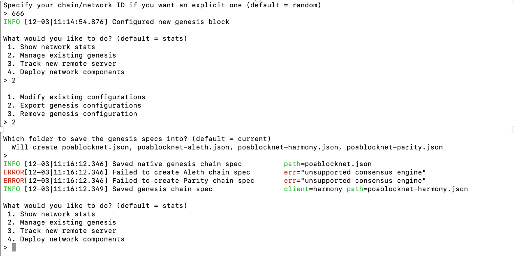

This completes genesis block creation. Use ("command+." or "control+c") to terminate session, and close the terminal window.

Please open your "Blockchain-Tools" folder. You should have node1 and node2 folders, and two (*.json) files.

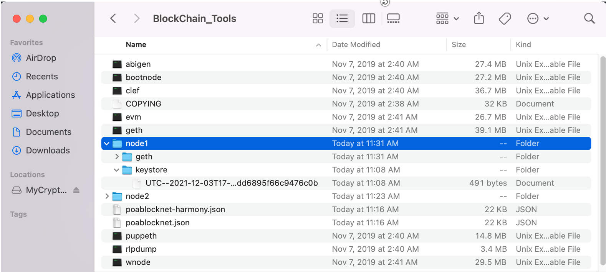

-----------------------------------------------------------------------------------------------------------------

## 12. Initialize the nodes with the genesis' json file
open a new terminal window. cd into the Blockchain-Tools folder and run the following commands (one by one)

#### ./geth --datadir node1 init networkname.json
Replace "networkname" with your own network name from step 3.

#### ./geth --datadir node2 init networkname.json
Again, replace "networkname" with your own network name from step 3.

This will initialize your two nodes
Close the terminal window.

-----------------------------------------------------------------------------------------------------------------

## 13. Start mining blocks nodes
open a new terminal window. cd into the Blockchain-Tools folder and run the following command

#### ./geth --datadir node1 --mine -minerthreads 1
scroll up and search for the following:
"enode://xxxx----------------------------------------------------------------------xxxxx@127.0.0.1:30303"
please copy this in notebook, we are going to need the above code for node2 (copy everything upto @IP address)

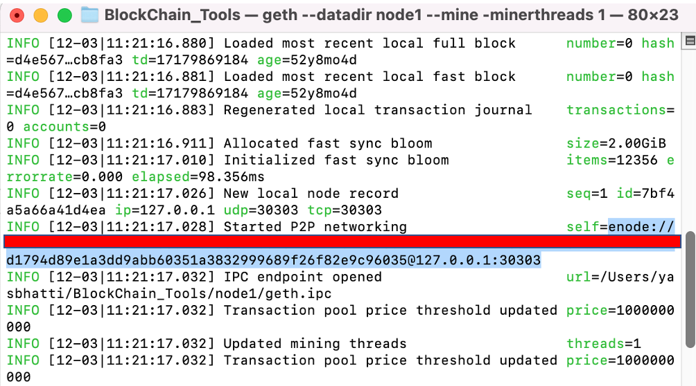

open a second terminal window. cd into the Blockchain-Tools folder and run the following command
#### ./geth --datadir node2 --port 30304 --rpc --bootnodes "ABOVE encode://.........."
Replace, "ABOVE encode://..........", with info that you copy from previous step.   

Your private PoA blockchain should now be running!
-----------------------------------------------------------------------------------------------------------------

## MyCrypto APP (set up your own network)
With both nodes up and running, the blockchain can be added to MyCrypto for testing.

#### Open the MyCrypto app, then click `Change Network` at the bottom left: 
to start Mycrypto aap, refer to installation_guide.md (Running in OS X)

#### Click "Add Custom Node". It should open a new pop-up window "Set Up your Custom Network"  

#### Use dropdown option in "Network" and select "Custom"

#### Enter same network name for "Node Name" and "Network Name"
please make sure to enter same network name that you saved in step 3

#### For "Currency", type "ETH"

#### For "Chain ID", type "333" (as you typed in step 9) 

#### For "URL", type "http://127.0.0.1:8545"

#### Finally, click "Save & Use Custom Node"
Make sure your new custom node is selected at the bottom left

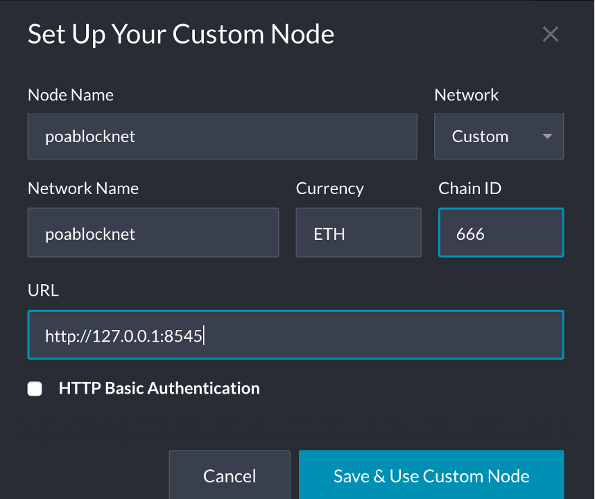

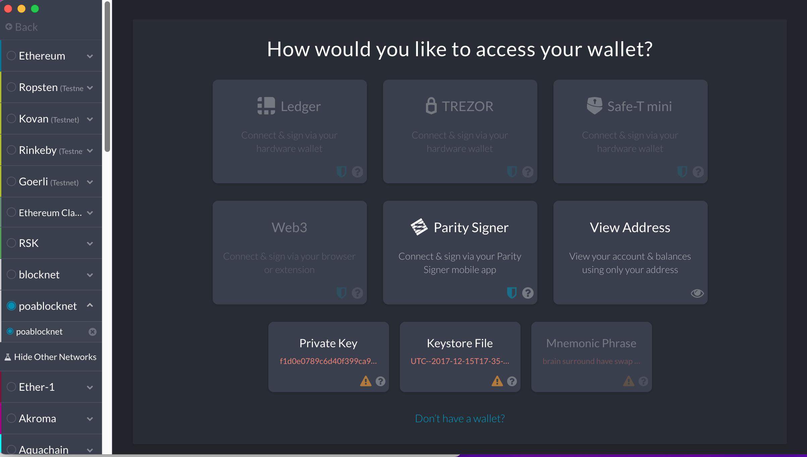

----------------------------------------------------------------------------------------------------------------

## Making Transaction using MyCrypto App
Here are the steps:

#### Select the "View & Send" option from the left menu pane, then click "Keystore file"

#### On the next screen, click "Select Wallet File", then navigate to the keystore directory inside your Node1 directory (in Blockchain-Tools folder), select the file located there, provide your password (that you saved in step 1) when prompted and then click "Unlock".

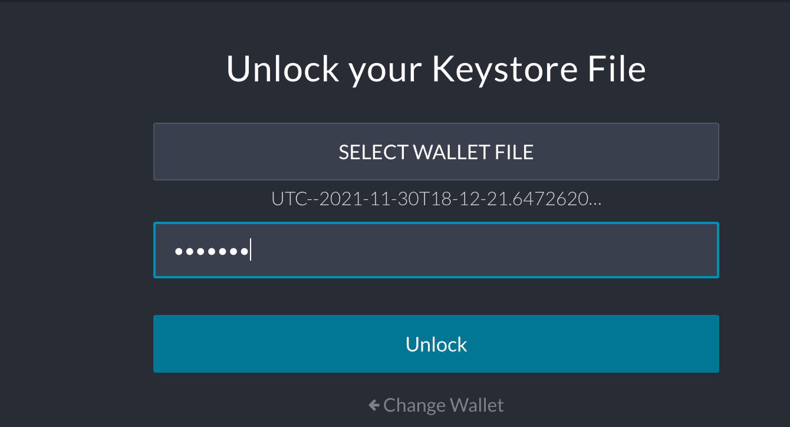

This will open your account wallet inside MyCrypto.
If you are setting this for the first time and follow the steps correctly, you should have plenty of money in this wallet (using node1 keystore file)

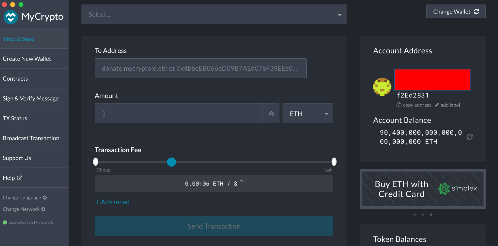

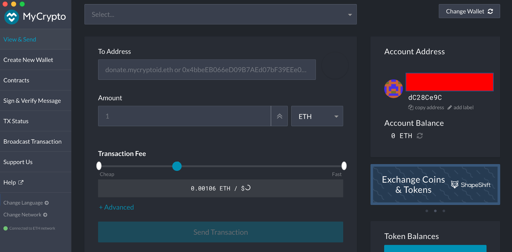

#### In the "To Address" box, type the account address from Node2, then fill in an arbitrary amount of ETH:

#### Confirm the transaction by clicking "Send Transaction", and the "Send" button in the pop-up window.
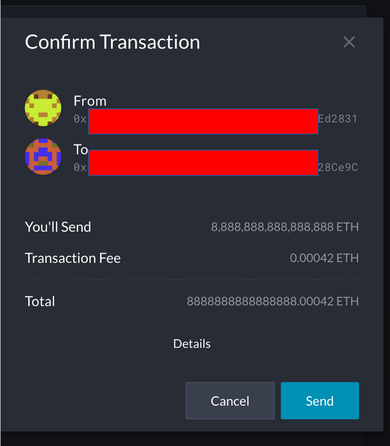

#### Click the "Check TX Status" when the green message pops up, confirm the logout:
You should see the transaction go from "Pending" to "Successful" in around the same blocktime you set in the genesis.

#### You can click the "Check TX Status" button to update the status.
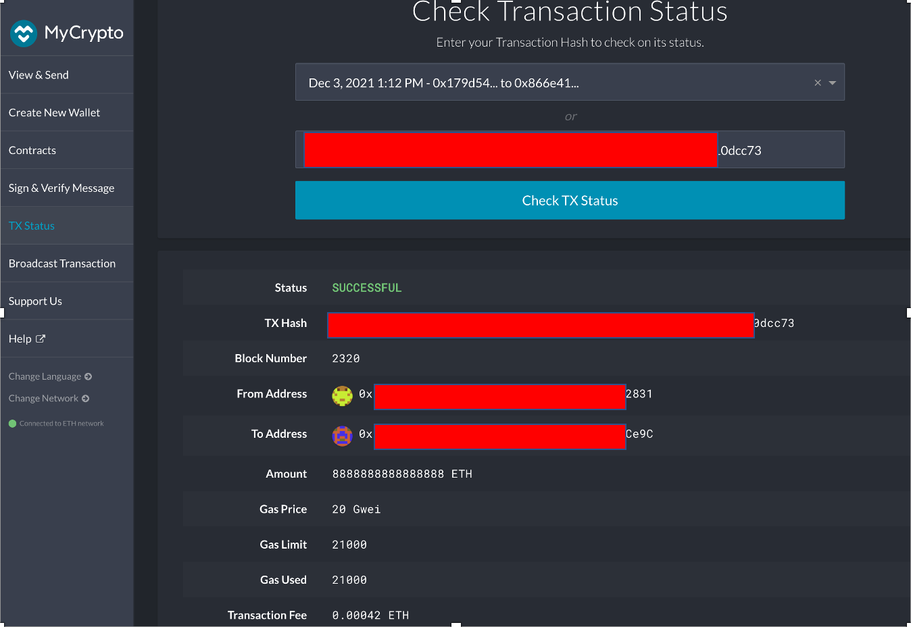

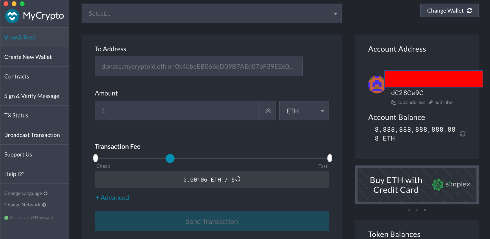

-----------------------------------------------------------------------------------------------------------------
#### Note: 
If you have already set up your network, you might encounter some issues with your balance. 
you should then restart the process of creating nodes (first delete node1 and node2 folder and the two ".json" files in "BlockChain-Tools" folder, and then follow above steps starting with step 1). For step 2, use the following changes:
##### Use the previously created network name (which is showing up in MyCrypto app)
##### Use first six letters of "Public address of the key" from step1 (node1), and convert them to decimal. Use this decimal value as your network name. You are going to use existing network, so make the appropriate changes in subsequent steps.

Here is a link which you could leverage for converting hex-to-decimal value
https://www.rapidtables.com/convert/number/hex-to-decimal.html

Here is another link for troubleshooting reference:
https://ethereum.stackexchange.com/questions/58712/try-running-mycrypto-with-my-local-parity-nodes

-----------------------------------------------------------------------------------------------------------------
